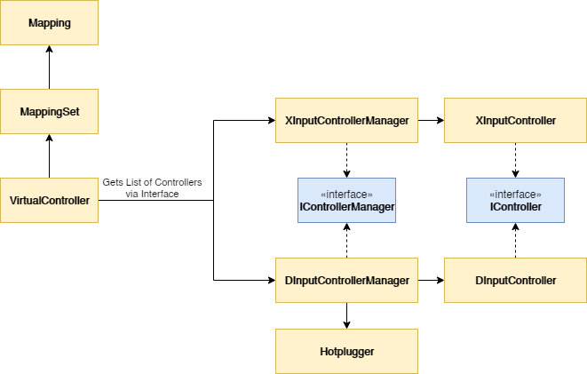
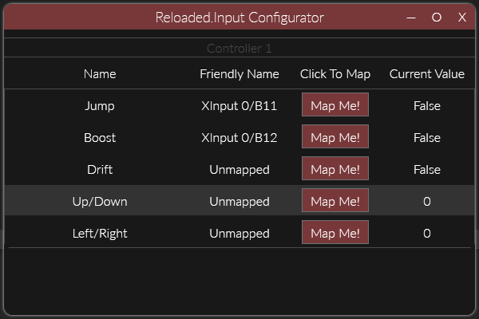

<div align="center">
	<h1>Project Reloaded: Input Library</h1>
	
	<br/> <br/>
	<strong><i>A simple input mapper for input mods.</i></strong>
	<br/> <br/>
	<!-- NuGet -->
	<a href="https://www.nuget.org/packages/Reloaded.Input">
		
	</a>
</div>

# Reloaded.Input

Reloaded.Input is a very simple personal use controller remapping library that wraps XInput and DirectInput in a common shared interface. It abstracts multiple real controllers, such as a keyboard, joystick and mouse into a singular controller.

The core idea of the library is that you can map keys and axis from any controller to an action, just like an emulator would. This allows for very easy button rebinding in any game.

I created this library in 2 days for the sole purpose of writing input mods for old games :).

## Usage

Basic usage of the library is as follows:

**Instantiation**

```csharp
// Create a controller which
var Controller = new VirtualController("Controller.json");
```

This will automatically load any mappings from `Controller.json` if present.

**Mapping Keys**

You map a key through the use of the asynchronous function `Map()`.

```csharp
// mappingIndex: Unique number (per controller) associated with the mapping.
// type: Axis or Button
// callBackFunction: Executed after every input check during mapping.
//					 This is where you cancel your token if needed.
await Controller.Map(mappingIndex, type, cancellationToken, callBackFunction);
```

The idea is that every single input mapping, whether it is an axis or button is associated with a unique `Mapping Index` per controller. This mapping index is used to later retrieve inputs.

**Getting Inputs**

Use the same mapping index as the original mapping was made with to get the input for a given controller.

```csharp
var button = Source.GetButton(mappingIndex);
var axis   = Source.GetAxis(mappingIndex);
```

Buttons are either false (not pressed) or true (pressed).
Axis have a range of -10000 to 10000 (Defined in `AxisSet.MinValue` and `AxisSet.MaxValue`).

Defaults are false and 0.0f respectively.

**Save Mappings**

```csharp
Controller.Save();
```

This saves the mappings back to the location the controller was instantiated from.

## Structure of Reloaded.Input

The structure of the library approximately resembles the following structure:



This has been slightly simplified for brevity.

## The Configurator



The configurator is a sister library to the main `Reloaded.Input` library that provides a simple input configuration form. This form can be executed from any class library or console application provided that the user has the .NET Core Desktop Runtime installed.

Here is an example of how to start the configurator:
```csharp
[STAThread] // Necessary to start a WPF application
static void Main(string[] args)
{
    // Define the buttons to map.
    var mappingEntries = new MappingEntry[]
    {
        new MappingEntry("Jump", 0, MappingType.Button),
        new MappingEntry("Boost", 1, MappingType.Button),
        new MappingEntry("Drift", 2, MappingType.Button),

        new MappingEntry("Up/Down", 3, MappingType.Axis),
        new MappingEntry("Left/Right", 4, MappingType.Axis),
    };

	// Make a new WPF Application
    var configurator = new WPF.Configurator();
    
    // Run the main window.
    configurator.Run(new ConfiguratorWindow(new ConfiguratorInput[]
    {
        // Define the controllers.
        new ConfiguratorInput("Controller 1", "Controller1.json", new ObservableCollection<MappingEntry>(mappingEntries)),
        new ConfiguratorInput("Controller 2", "Controller2.json", new ObservableCollection<MappingEntry>(mappingEntries)),
        new ConfiguratorInput("Controller 3", "Controller3.json", new ObservableCollection<MappingEntry>(mappingEntries)),
        new ConfiguratorInput("Controller 4", "Controller4.json", new ObservableCollection<MappingEntry>(mappingEntries)),
    }));
}
```

### Inside an Existing WPF Application

To execute this form inside an existing WPF application, simply emit the creation of a new WPF application (`new WPF.Configurator`) and instead simply show the window:

```csharp
var m = new ConfiguratorWindow( /* Parameter */ );
m.Activate();
m.Show();
```

Please note however that you'll need to have the Reloaded WPF default theme installed in your application-wide resources (`App.xaml`). This is a limitation of the `Reloaded.WPF` library at the moment.
